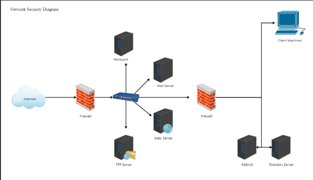

# Secure Network Devices

## Objective

This project aimed to provide hands-on experience in securing network devices using Cisco Packet Tracer as a simulation tool. It focused on configuring authentication for routers and switches, implementing DHCP for efficient IP management, and enforcing security measures to protect switch ports from unauthorized access and potential threats. This hands-on project was designed to enhance practical knowledge and strengthen understanding of network security.

### Skills Learned

- Configuring authentication on network devices (routers and switches)
- Implementing DHCP for efficient IP management.
- Securing switch ports to mitigate security threats.
- Utilizing Cisco Packet Tracer for network simulation and troubleshooting.
- Advanced understanding of network security concepts, best practices, and practical applications.

### Tools Used

- Cisco Packet Tracer (Network simulation software).
- Router and Switch configurations (CLI-based security settings)
- Networking protocols (Authentication, DHCP, and security best practices).

## Walkthrough
drag & drop screenshots here or use imgur and reference them using imgsrc

Every screenshot should have some text explaining what the screenshot is about.

Example below.

*Ref 1: Network Diagram*
